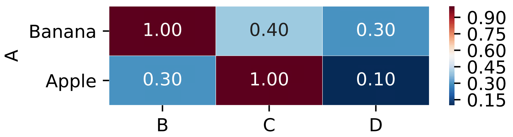

Table to heatmap, no clustering
=============

::

	usage: table2heatmap.py [-h] -f INPUT [-s SEP] [-o OUTPUT] [-W WIDTH]
	                        [-H HEIGHT] [-c CMAP]

	plot heatmap given a table, keep order.

	optional arguments:
	  -h, --help            show this help message and exit
	  -f INPUT, --input INPUT
	                        data table input, assume index and header (default:
	                        None)
	  -s SEP, --sep SEP     separator (default: None)
	  -o OUTPUT, --output OUTPUT
	                        output table name (default: yli11_2020-11-01.heatmap)
	  -W WIDTH, --width WIDTH
	                        Figure width, by default, w=N_row, if given, will
	                        replace the default value (default: None)
	  -H HEIGHT, --height HEIGHT
	                        Figure height, by default, w=N_col, if given, will
	                        replace the default value (default: None)
	  -c CMAP, --cmap CMAP  python cmap (default: RdBu_r)

Input
^^^^^

csv or tsv. The first column is row name, the first row is column name.

::

	A,B,C,D
	Banana,1,0.4,0.3
	Apple,0.3,1,0.1

Output
^^^^^^

Usage
^^^^^

.. code:: bash

	PATH=/home/yli11/HemTools/bin:/hpcf/lsf/lsf_prod/10.1/linux3.10-glibc2.17-x86_64/etc:/hpcf/lsf/lsf_prod/10.1/linux3.10-glibc2.17-x86_64/bin:/usr/lpp/mmfs/bin:/usr/lpp/mmfs/lib:/usr/local/bin:/usr/bin:/usr/local/sbin:/usr/sbin:/opt/ibutils/bin:/sbin:/cm/local/apps/environment-modules/3.2.10/bin:/opt/puppetlabs/bin
	echo $PATH
	export PATH=$PATH:"/home/yli11/HemTools/bin"
	hpcf_interactive.sh
	module load conda3
	source activate /home/yli11/.conda/envs/py2/

	table2heatmap.py -f input.csv -W 4 -H 1 -o output.pdf

Use ``-W`` and ``-H`` to control figure size.
