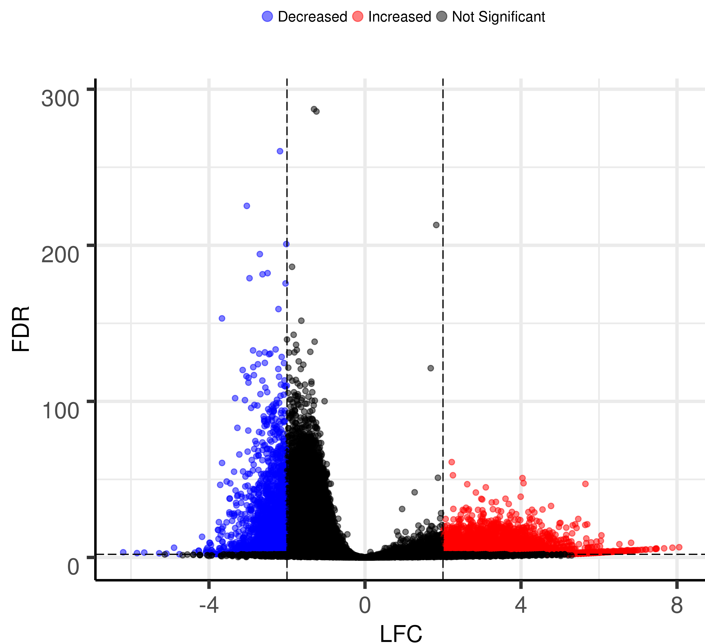

Volcano plot for logFC and P-value/FDR
======================================

.. argparse::
   :filename: ../bin/HemTools
   :func: main_parser
   :prog: HemTools
   :path: volcano_plot

Input file
^^^^^^^^^^

**INPUT: data table (-f option, required).**

This is a data table, could be csv (default) or tsv. Seperator is provided by user. Basically, two columns (provided by user) will be used to make volcano plot. 

Usage
^^^^^

.. code:: bash

	hpcf_interactive

	module load python/2.7.13

	## for differential peaks

    HemTools volcano_plot -f diffPeaks_output.txt -s "\t" --LFC_column logFC --FDR_column adj.P.Val

    ## for diffGene pipeline output

    HemTools volcano_plot -f H2_vs_H1.gene.final.combined.tpm.csv -s , --LFC_column logFC --FDR_column qval

.. note:: Once the figure is made, it will be emailed to you.

Report bug
^^^^^^^^^^

Once the job is finished, you will be notified by email with some attachments.  If no attachment can be found, it might be caused by an error. In such case, please go to the result directory (where the log_files folder is located) and type: 

.. code:: bash

    HemTools report_bug

R code
^^^^^^

If you are not satisfied with the figure (figsize, dpi, point size, etc), here's the source code for you to customize your figure. 

.. literalinclude:: ../../../subcmd/volcano_plot.R
   :language: R
   :linenos:

Latest R code
^^^^^^^

::

  library(EnhancedVolcano)

  input_table = "20copy_vs_Jurkat.gene.final.combined.tpm.csv"
  seperator = ","
  LFC_column = "logFC"
  LFC_cutoff = 2
  LFC_axis_name = "LFC"
  FDR_column = "qval"
  FDR_cutoff = 0.01
  FDR_axis_name = "-logFDR"
  Title = "20copy vs Jurkat"
  output_figure = "Volcano_plot_yli11_2020-12-03.pdf"

  if (seperator == "\\t"){
    res <- read.csv(input_table, header=TRUE,sep="\t")
  }else{
    res <- read.csv(input_table, header=TRUE,sep=seperator)
  }

  print (head(res))
  rownames(res) = make.unique(as.character(res[,4]))
  keyvals <- rep('black', nrow(res))

  names(keyvals) <- rep('Not Significant', nrow(res))

  keyvals[which(res[LFC_column] > LFC_cutoff & res[FDR_column] < FDR_cutoff)] <- 'red'
  names(keyvals)[which(res[LFC_column] > LFC_cutoff & res[FDR_column] < FDR_cutoff)] <- 'Increased'

  keyvals[which(res[LFC_column] < -LFC_cutoff & res[FDR_column] < FDR_cutoff)] <- 'blue'
  names(keyvals)[which(res[LFC_column] < -LFC_cutoff & res[FDR_column] < FDR_cutoff)] <- 'Decreased'

  sel_df = res[which((abs(res[LFC_column]) > LFC_cutoff)&(res[FDR_column] < FDR_cutoff)),]

  sel_df[FDR_column] = -log10(sel_df[FDR_column])

  f <- function(y) seq(floor(min(y)), ceiling(max(y)))
  p=EnhancedVolcano(res,
      lab = rownames(res),
      # selectLab = c("Ets1","Nfix","Hmga2","Lpl","Il10ra","Cdkn2a","Irs2","Il1b","Socs3","Pdcd1","Mmp8","Il18","Ccnd1","Lgals3","Bcl2l11", "Ccl5","Gzmb","Bax","Mdm2","Chek2"),
      selectLab = c(""),
      # check_overlap = T,
      x = LFC_column,
      y = FDR_column,
    xlab = LFC_axis_name,
    ylab = FDR_axis_name,
      title = Title,
      colOverride = keyvals,
      colConnectors = 'grey50',
      pCutoff = FDR_cutoff,
      FCcutoff = LFC_cutoff,
      DrawConnectors = F,
      widthConnectors = 0.2,
      transcriptPointSize = 1,
      gridlines.major = TRUE, gridlines.minor = FALSE,
      transcriptLabSize = 3.0)+ scale_y_continuous(breaks = f)+ scale_x_continuous(breaks = f)+
    xlim(-10, 15)+
    ylim(0, 37)

  pg <- ggplot_build(p)

  sel_df['x'] = sel_df[LFC_column]
  sel_df['y'] = sel_df[FDR_column]

  p = p+geom_text_repel(data=sel_df[sel_df$x > 0,],aes(x=x,y=y,label=ext_gene),
  point.padding = 0.2,
          segment.color="#878686",
          inherit.aes=F,
          nudge_x = 2,
      arrow = arrow(length = unit(0.015, "npc")),force=3)

  p = p+geom_text_repel(data=sel_df[sel_df$x < 0,],aes(x=x,y=y,label=ext_gene),
  point.padding = 0.2,
          segment.color="#878686",
          nudge_x = -2,
      arrow = arrow(length = unit(0.015, "npc")),force=3)

  ggsave(output_figure,dpi=600,device ="pdf")

